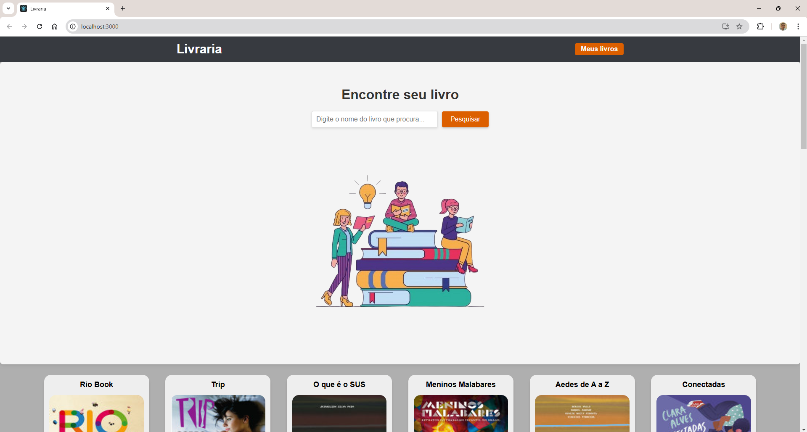
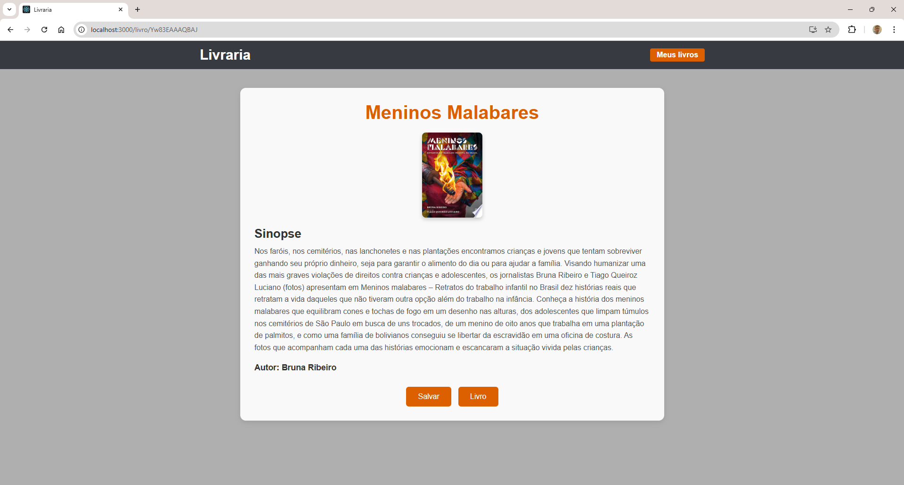
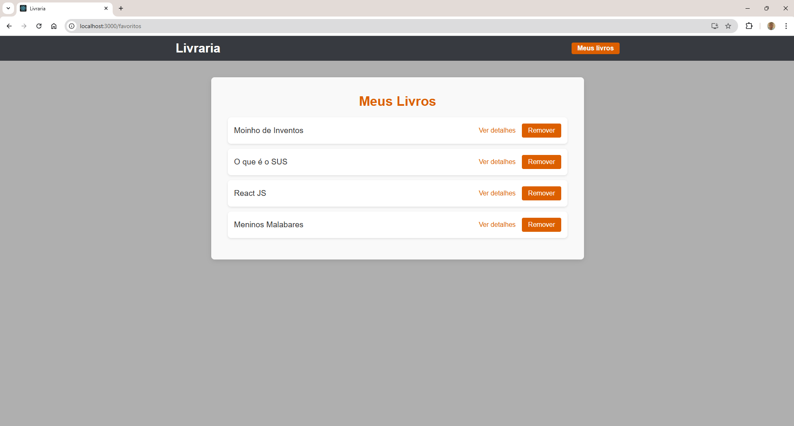

# Projeto Livraria

**Livraria Digital** é o meu primeiro projeto em **React**! Esta aplicação foi criada com o objetivo de explorar e aplicar os conceitos do React, proporcionando uma plataforma interativa onde os usuários podem pesquisar livros, salvar seus favoritos e visualizar detalhes de cada obra através da API do Google Books.

## 🌟 Funcionalidades Principais

- **🔍 Busca Dinâmica**: Pesquise por livros e autores, com resultados atualizados em tempo real.
- **📖 Detalhes do Livro**: Exibe informações completas sobre cada livro, como título, autor, descrição e imagem da capa.
- **❤️ Favoritos**: Adicione livros à sua lista de favoritos para fácil acesso.
- **🌐 Pesquisa no Google**: Ao visualizar os detalhes de um livro, é possível realizar uma pesquisa direta no Google para mais informações.

## 💻 Tecnologias Utilizadas

- **React**: Framework para construção de interfaces dinâmicas e interativas.
- **React Router**: Biblioteca para gerenciamento de navegação entre as páginas da aplicação.
- **API Google Books**: Fonte de dados dos livros, que fornece informações sobre títulos, autores, descrições e imagens das capas.
- **CSS**: Utilizados para a estilização da aplicação e garantir a responsividade.

## 📸 Demonstração

- **Página Inicial - Busca de Livros**

- **Página de Detalhes**

- **Página de Favoritos**

## 🧑‍💻 Autor

Desenvolvido com dedicação por Mateus Rodrigues.
📧 Entre em contato: mateusdev23@gmail.com

